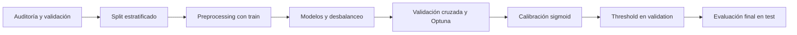
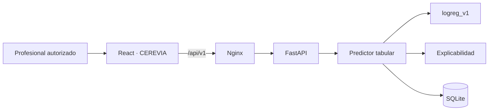

# 🧠 CEREVIA — Stroke Risk AI

Sistema inteligente de apoyo al cribado del riesgo de ictus desarrollado como proyecto **Data Scientist / AI Developer**.

**Inteligencia que ayuda a anticiparse.**

CEREVIA combina un pipeline reproducible de Machine Learning con una API, una interfaz web y persistencia de evaluaciones. El predictor desplegado actualmente utiliza datos tabulares clínicos y demográficos.

> **Aviso:** CEREVIA es un prototipo educativo de apoyo a la criba preliminar. No realiza diagnósticos médicos ni sustituye la valoración de un profesional sanitario.

## Objetivo

Construir una solución de IA completa y trazable capaz de validar datos, comparar modelos, generar estimaciones explicables, conservar evaluaciones y ofrecer el flujo mediante web, API y CLI. El proyecto también explora Deep Learning tabular e imágenes CT sin comprometer el predictor productivo.

## Funcionalidades principales

- Nueva evaluación con validación de datos clínicos.
- Predicción mediante el modelo tabular versionado `logreg_v1`.
- Clasificación expresada exclusivamente respecto al threshold.
- Explicación de factores que aumentan o disminuyen el score.
- Historial cronológico y detalle de evaluaciones persistidas.
- Trazabilidad de score, threshold, calibración y versión del modelo.
- Guardrails contra afirmaciones diagnósticas o causales.
- API REST, CLI, tracking con MLflow y ejecución con Docker.

```text
Nueva evaluación → predicción → interpretación → historial → detalle
```

## Dataset y variables

El dataset tabular auditado contiene **4.981 registros**, 10 variables predictoras y el target binario `stroke`.

| Grupo | Variables |
|---|---|
| Numéricas | `age`, `avg_glucose_level`, `bmi` |
| Binarias | `hypertension`, `heart_disease` |
| Categóricas | `gender`, `ever_married`, `work_type`, `Residence_type`, `smoking_status` |
| Target | `stroke` |

La clase positiva representa el **4,98 %**, con un ratio aproximado de **19,08:1**. Por ello, accuracy no se utiliza como criterio principal.

El split es estratificado y reproducible con seed 42:

| Split | Registros | Proporción aproximada |
|---|---:|---:|
| Train | 3.187 | 64 % |
| Validation | 797 | 16 % |
| Test | 997 | 20 % |

Test permaneció aislado durante la selección, optimización, calibración y elección del threshold.

## Pipeline de Data Science



El preprocessing utiliza `ColumnTransformer`:

- numéricas: imputación por mediana y `StandardScaler`;
- binarias: imputación por valor más frecuente;
- categóricas: imputación por valor más frecuente y `OneHotEncoder` con categorías desconocidas ignoradas;
- ajuste exclusivo con train para evitar leakage.

Se compararon baseline, Logistic Regression, Random Forest, Gradient Boosting, SVM y Decision Tree; estrategias de `class_weight`, Random Oversampling y SMOTE; validación cruzada, Optuna, calibración y optimización de threshold.

## Modelo final

El predictor productivo es una **Logistic Regression calibrada**:

| Propiedad | Valor |
|---|---|
| Versión | `logreg_v1` |
| `class_weight` | `balanced` |
| `C` | `0.001486` |
| Solver | `liblinear` |
| `max_iter` | `500` |
| Seed | `42` |
| Calibración | `sigmoid` |
| Threshold | `0.05` |

```text
Preprocessing → Logistic Regression → calibración sigmoid → threshold 0.05
```

El threshold se fijó exclusivamente con validation para mantener recall elevado y reducir falsos positivos entre las configuraciones válidas.

## Resultados finales

Resultados almacenados sobre test:

| Métrica | Resultado |
|---|---:|
| Precision | 0.137809 |
| Recall | 0.780000 |
| F1 | 0.234234 |
| ROC-AUC | 0.825723 |
| PR-AUC | 0.145957 |
| TP / FN | 39 / 11 |
| FP / TN | 244 / 703 |

El modelo detecta 39 de los 50 casos positivos de test. En este prototipo de cribado se priorizaron recall y reducción de falsos negativos frente a precision o accuracy. El compromiso incrementa los falsos positivos y exige interpretar el resultado solo como apoyo preliminar.

Estas métricas describen rendimiento experimental sobre el dataset disponible; **no constituyen validación clínica**.

## Explicabilidad

La explicación individual compara el score original con el obtenido al sustituir cada variable por un valor de referencia aprendido de train: mediana para variables numéricas y moda para categóricas. Los factores se separan y ordenan según aumenten o disminuyan el score.

Las influencias describen comportamiento del modelo, no causalidad médica. Los guardrails están centralizados y cubiertos por tests: la aplicación no afirma que una persona sufrirá o no sufrirá un ictus, no recomienda tratamientos y rechaza entradas imposibles o no finitas.

## Arquitectura de la aplicación



- **Frontend:** React, Vite y React Router; Nginx sirve la SPA y actúa como proxy.
- **Backend:** FastAPI, Pydantic y dependency injection del predictor.
- **Inferencia:** `PredictionService` coordina modelo, explicación y persistencia.
- **Persistencia:** SQLAlchemy y Alembic sobre SQLite.
- **Modelo:** artifacts versionados cargados desde el filesystem.

La interfaz pública utiliza únicamente el predictor tabular. Los modelos experimentales no se cargan durante el arranque productivo.

## Tecnologías

| Área | Tecnologías |
|---|---|
| Data Science | Python 3.12, Pandas, NumPy, Scikit-learn, Imbalanced-learn, Optuna |
| Deep Learning experimental | TensorFlow, Keras |
| Tracking | MLflow |
| Backend | FastAPI, Pydantic, Uvicorn |
| Persistencia | SQLAlchemy, Alembic, SQLite |
| Frontend | React 19, React Router, Vite, CSS |
| Infraestructura | Docker, Docker Compose, Nginx, Railway |
| Calidad | Pytest, ESLint, GitHub Actions |

## Persistencia y trazabilidad

La base de datos relaciona `Patient`, `Assessment`, `ModelVersion` y `Prediction`. Conserva los datos originales, su origen, score, clasificación, threshold y versión utilizada.

`DATABASE_URL` configura la conexión por entorno. Localmente se utiliza `sqlite:///data/stroke_app.db`; Docker y Railway emplean almacenamiento persistente. Alembic aplica las migraciones al iniciar el backend en contenedor.

## API y CLI

| Método | Ruta | Función |
|---|---|---|
| `GET` | `/api/v1/health` | Disponibilidad real y versión cargada |
| `POST` | `/api/v1/predictions` | Crear evaluación y predicción |
| `GET` | `/api/v1/assessments` | Consultar historial |
| `GET` | `/api/v1/assessments/{assessment_id}` | Consultar detalle |

Swagger local: [http://localhost:8000/docs](http://localhost:8000/docs).

```powershell
python -m src.cli.main
```

La CLI reutiliza schemas, modelo, servicio de predicción, persistencia y mensajes de seguridad.

## Testing

```powershell
.\.venv\Scripts\python.exe -m pytest -q
```

La suite usa recursos temporales y aislados cuando corresponde. Cubre validación, splits, preprocessing, leakage, modelos, calibración, threshold, servicios, API, base de datos, CLI, guardrails, explicabilidad, MLflow, integración, Deep Learning y la interfaz común de predictors.

Comprobaciones del frontend:

```powershell
cd frontend
npm ci
npm run lint
npm run build
```

## MLflow

MLflow registra parámetros, métricas, tags, artifacts y modelos:

- `stroke-risk-model-selection`: baseline, modelos clásicos, validación cruzada, desbalanceo y Optuna;
- `stroke-risk-calibration-threshold`: calibración y threshold;
- `stroke-risk-final-model`: entrenamiento y evaluación final.

```text
stroke-risk-final-model
└── final-model-logreg-v1
    └── stroke-risk-screening-model (versión 1)
```

El tracking local usa `sqlite:///mlflow.db` y admite override mediante `MLFLOW_TRACKING_URI`.

```powershell
mlflow ui --backend-store-uri sqlite:///mlflow.db
```

UI: [http://127.0.0.1:5000](http://127.0.0.1:5000).

> Volver a ejecutar `src.models.final_model` puede crear otra versión registrada. No es necesario para ejecutar CEREVIA.

`mlflow.db`, `mlruns/` y `mlartifacts/` no se versionan. La inferencia no necesita MLflow activo.

## Docker

Requiere Docker con Docker Compose:

```powershell
docker compose up --build -d
```

| Servicio | URL |
|---|---|
| CEREVIA | [http://localhost:5173](http://localhost:5173) |
| API | [http://localhost:8000](http://localhost:8000) |
| Swagger | [http://localhost:8000/docs](http://localhost:8000/docs) |
| MLflow | [http://localhost:5001](http://localhost:5001) |

```powershell
docker compose ps
docker compose logs
docker compose down
```

El stack contiene frontend, backend y MLflow. SQLite persiste en `app_data`; `docker compose down -v` elimina los volúmenes y sus datos. El backend ejecuta `alembic upgrade head` antes de iniciar Uvicorn y opera con un worker.

La imagen no incluye datasets de entrenamiento, solo los artifacts productivos:

- `stroke_model_logreg_v1.joblib`;
- `threshold_logreg_v1.json`;
- `reference_values_logreg_v1.json`.

El último contiene valores agregados reproducibles usados por la explicación, evitando incorporar `train.csv`.

## Integración continua

`.github/workflows/ci.yml` se activa en Pull Requests y mediante `workflow_dispatch`. Ejecuta en paralelo:

1. Python 3.12: instalación y `python -m pytest -q` con SQLite y MLflow temporales.
2. Node 22: `npm ci`, `npm run lint` y `npm run build`.

Un fallo en pytest, lint o build marca el workflow como fallido. No necesita Docker ni servidor MLflow externo.

## Despliegue en Railway

CEREVIA está desplegada y operativa:

- **Aplicación:** [https://frontend-production-e01f.up.railway.app/](https://frontend-production-e01f.up.railway.app/)
- **Formulario:** [https://frontend-production-e01f.up.railway.app/assessment](https://frontend-production-e01f.up.railway.app/assessment)

```text
Frontend público React/Nginx
→ red privada Railway
→ FastAPI
→ SQLite persistente en /app/data
```

El frontend reenvía `/api/v1` al backend privado. Solo el frontend tiene dominio público; el backend usa una réplica y un volumen en `/app/data`. Se validaron health, predicción e historial persistido. MLflow no se despliega porque no participa en inferencia.

## Deep Learning y líneas experimentales

Estas líneas **no sustituyen al predictor desplegado**.

### Red neuronal tabular

Usa los mismos datos, splits, preprocessing y métricas que el modelo clásico:

| Métrica test | Red neuronal | Logistic Regression |
|---|---:|---:|
| Precision | 0.138158 | 0.137809 |
| Recall | 0.840000 | 0.780000 |
| F1 | 0.237288 | 0.234234 |
| ROC-AUC | 0.835333 | 0.825723 |
| PR-AUC | 0.163629 | 0.145957 |
| FN / FP | 8 / 262 | 11 / 244 |

La red neuronal gana experimentalmente en recall, PR-AUC y falsos negativos, pero genera más falsos positivos, es más compleja, no está calibrada y no dispone de prueba de significancia. La Logistic Regression conserva estabilidad, interpretabilidad y sencillez operativa, por lo que sigue en producción. Sus dependencias están aisladas en `requirements-dl.txt`.

### CNN experimental para imágenes CT

La CNN CT empleó 2.501 JPEG del **Brain Stroke CT Image Dataset de Afridi Rahman** y un split por 82 grupos visibles para reducir leakage entre cortes relacionados. `group_id` es un proxy de serie o grupo, no un paciente confirmado.

En test obtuvo recall 0.57647, F1 0.41090, ROC-AUC 0.47633 y PR-AUC 0.38864. La caída frente a validation evidencia generalización insuficiente en grupos no vistos. Está registrada como prototipo (`deployed=false`), no tiene endpoint público y no es apta para uso clínico.

### Arquitectura multimodal

FastAPI incorpora un contrato mínimo `Predictor`. El servicio tabular lo satisface sin alterar su comportamiento. La CNN CT permanece independiente: no se carga en producción, no comparte artifacts y no existe fusión ni ensemble.

La incorporación futura de imagen requeriría validación externa, contrato específico, almacenamiento seguro y trazabilidad adicional. Véase `docs/multimodal_architecture.md`.

## Metodología de desarrollo

- Specification-Driven Development y Kanban.
- Desarrollo incremental mediante ramas y Pull Requests.
- Separación estricta de train, validation y test.
- Reproducibilidad con seeds, manifests, artifacts y MLflow.
- Tests automatizados y Clinical Safety Guardrails.
- Evolución arquitectónica aditiva y compatible.

## Estructura del repositorio

```text
├── alembic/                 # Migraciones
├── artifacts/               # Modelos y metadata
├── configs/                 # Configuración por entorno
├── data/                    # Datos raw y processed
├── docs/                    # Especificaciones y arquitectura
├── frontend/                # React, Vite y Nginx
├── reports/                 # Métricas, análisis y figuras
├── src/
│   ├── api/                 # FastAPI, schemas y servicios
│   ├── cli/                 # Interfaz de consola
│   ├── data/                # Auditoría, validación y splits
│   ├── database/            # SQLAlchemy y repositorios
│   ├── models/              # Experimentos ML y DL
│   ├── preprocessing/       # Transformaciones
│   └── tracking/            # Helpers MLflow
├── tests/                   # Suite automatizada
├── docker-compose.yml
├── requirements.txt
└── requirements-dl.txt
```

## Cómo ejecutar el proyecto

Opción recomendada:

```powershell
docker compose up --build -d
```

Abrir [http://localhost:5173](http://localhost:5173).

Desarrollo local:

```powershell
.\.venv\Scripts\python.exe -m uvicorn src.api.main:app --reload
```

En otra terminal:

```powershell
cd frontend
npm ci
npm run dev
```

`.env.example` documenta `APP_ENV`, `DATABASE_URL`, `MODEL_PATH`, `MODEL_THRESHOLD`, `MLFLOW_TRACKING_URI` y `RANDOM_SEED`. El archivo `.env` local no se versiona.

## Estado final

✅ **Proyecto finalizado para la entrega académica.**

- Pipeline y modelo clásico final completados.
- Frontend CEREVIA, backend, persistencia e historial operativos.
- Explicabilidad, trazabilidad y guardrails incorporados.
- Suite automatizada, CI, Docker y despliegue público funcionales.
- Deep Learning tabular, CNN CT y arquitectura multimodal documentados como extensiones experimentales.

## Disclaimer clínico

> Esta herramienta es un sistema de apoyo a la criba. No constituye un diagnóstico médico y no sustituye la valoración de un profesional sanitario. Las explicaciones describen el comportamiento del modelo y no implican causalidad médica.
