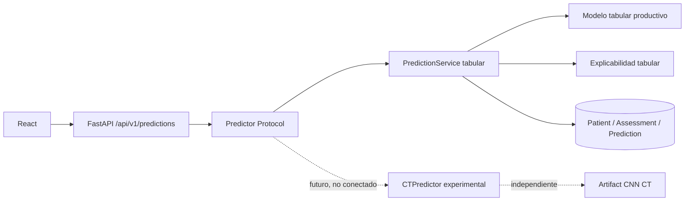

# Arquitectura preparada para predictores multimodales

## Objetivo y alcance

La aplicación incorpora una frontera mínima `Predictor` para que FastAPI pueda
recibir en el futuro implementaciones de distintas modalidades sin acoplar el
endpoint público a una clase concreta. Esta preparación no implementa fusión
multimodal, ensembles ni inferencia CT en producción.

El único predictor activo continúa siendo el modelo tabular validado y
desplegado actualmente.

## Arquitectura productiva actual

FastAPI construye `PredictionService` durante su lifespan y lo registra como
predictor activo. El endpoint obtiene ese componente mediante dependency
injection y solo conoce el contrato `Predictor`.

## Predictor Protocol

El protocolo estructural común expone únicamente:

- `modality`.
- `model_name`.
- `model_version`.
- `is_ready`.
- `predict(input_data)`.

No incluye entrenamiento, MLflow, persistencia, explicabilidad ni schemas
multimodales. Cada implementación conserva esas decisiones dentro de su propia
modalidad.

## Predictor tabular

`PredictionService` satisface el protocolo con:

- Modalidad `tabular`.
- Modelo `stroke-risk-screening-model`.
- Versión delegada en `ModelService`.
- Disponibilidad ligada al modelo tabular cargado.

Su inferencia, threshold, explicación y persistencia no cambian. También se
mantienen sin cambios `PredictionRequest`, `PredictionResponse`, la ruta
`POST /api/v1/predictions` y el historial existente.

## Predictor CT experimental

La CNN CT permanece independiente:

- Experimento y modelo MLflow: `stroke-risk-ct-cnn`.
- Stage: `prototype`.
- `deployed=false`.
- Sin endpoint público.
- Sin importación desde la interfaz común o el servicio tabular.
- Sin carga de TensorFlow, Keras o artifacts CT durante el arranque productivo.

La CNN CT **no se integra en producción** porque su evaluación final mostró
generalización insuficiente en grupos no vistos. Los `group_id` son proxies de
serie o grupo de cortes, no identificadores de pacientes confirmados.

## Dependency injection en FastAPI

`get_predictor()` valida que exista un predictor activo y que esté preparado.
Si falta o no está disponible, el endpoint devuelve HTTP 503. Los tests pueden
sustituirlo mediante `app.dependency_overrides` por una implementación fake sin
sklearn, base de datos ni CNN.

Este punto de composición permite incorporar posteriormente otro predictor sin
modificar el endpoint tabular actual. La selección futura deberá hacerse fuera
del contrato HTTP existente o mediante una ruta nueva explícita; no se inferirá
la modalidad de forma implícita.

## Independencia de modalidades

Los modelos permanecen separados en cuatro dimensiones:

| Aspecto | Tabular | CT experimental |
|---|---|---|
| Input | Variables estructuradas | Imagen CT |
| Implementación | `PredictionService` | Futura `CTPredictor` |
| Artifacts | `artifacts/final_model/` | `artifacts/ct_cnn/` |
| MLflow | Modelo productivo tabular | `stroke-risk-ct-cnn` |

No existe combinación de scores, voting, ensemble ni dependencia entre
artifacts.

## Persistencia y evolución futura

La persistencia actual es tabular:

- `Patient` conserva su identidad técnica.
- `Assessment` almacena las variables originales del formulario.
- `Prediction` almacena score, clasificación y versión.
- El historial continúa representando evaluaciones tabulares existentes.

US-36 no requiere migraciones. Incorporar una imagen en el futuro requeriría
una ampliación aditiva, por ejemplo una entidad específica para evaluaciones de
imagen y una referencia a su almacenamiento seguro. Esa ampliación no obliga a
reconstruir `Patient`, borrar assessments ni alterar el historial tabular.

## React y contrato API

React continúa enviando el mismo `PredictionRequest` y recibiendo el mismo
`PredictionResponse`. No conoce el protocolo Python ni necesita reconstruirse
por introducir esta frontera interna.

Un futuro flujo CT necesitaría su propio mecanismo de carga, validación y
consentimiento. No se añade ahora al frontend ni se reutiliza indebidamente el
schema tabular para imágenes.

## Requisitos antes de habilitar CT

Antes de considerar un predictor CT productivo serían necesarios, como mínimo:

1. Datos independientes con metadata suficiente y separación verificable por
   paciente o estudio.
2. Generalización adecuada en validación externa.
3. Protocolo de imagen y contrato API específicos.
4. Almacenamiento seguro, control de acceso y política de retención.
5. Persistencia aditiva y trazabilidad de modalidad y versión.
6. Guardrails y revisión clínica del flujo completo.
7. Validación operativa, de privacidad y de seguridad.
8. Aprobación explícita para cambiar `deployed=false`.

## Límites y elementos fuera de alcance

Esta arquitectura no proporciona actualmente:

- Predictor CT operativo en FastAPI.
- Endpoint público de imágenes.
- Fusión tabular–CT.
- Ensemble multimodal.
- Comparación o selección automática de modalidades.
- Persistencia de imágenes.
- Cambios en React.
- Sustitución del modelo tabular.

La interfaz prepara un punto de extensión controlado; no convierte por sí sola
un modelo experimental en una capacidad clínica o productiva.
